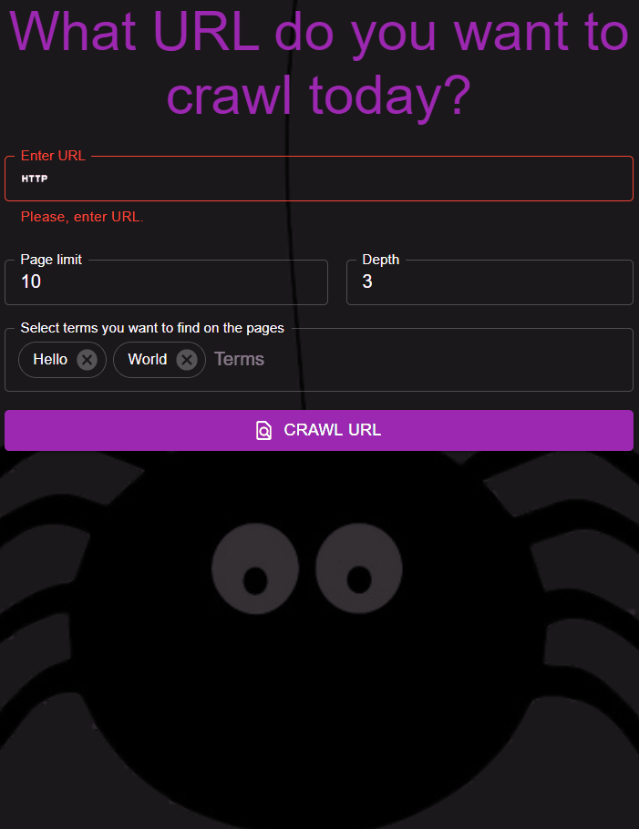

## Deploys

Web crawler [frontend deploy](https://lartiquel.github.io/crawler/).

Web crawler [backend deploy](https://srawler.herokuapp.com/api/).
I intentionally left backend api opened for everyone for educational purposes.

  

## Crawler

Crawler scans provided url trying to find more links and counting number of specified terms entries on the page. 
Crawler crawls to specified depth and repeats previous procedure for specified number of pages.

## App's tech stack

Web crawler app consists of two main parts:
* Backend. Tech stack:
	* Java 8.
	* Spring (Boot, Security).
	* Jsoup html-parser.
* Frontend. Tech stack:
	* React (Hooks).
	* Redux.
	* MaterialUI.
	* Axios.
	
***Peace!***