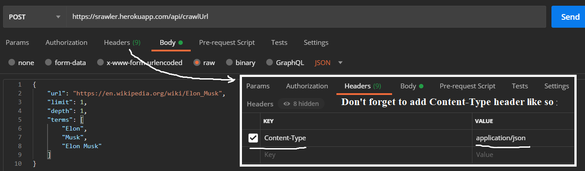
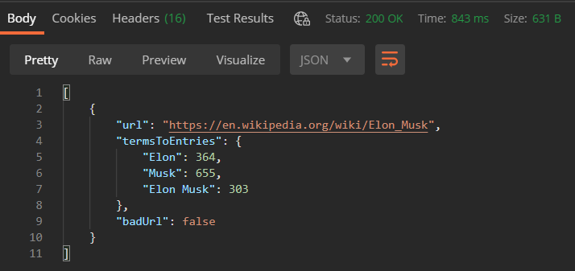

# Web crawler

## Frontend

Web crawler [frontend deploy](https://lartiquel.github.io/crawler/) on Github Pages.

  

### Frontend tech stack:
	* React (Hooks).
	* Redux.
	* Formik.
	* Yup.
	* MaterialUI.
	* Axios.

## Backend

Web crawler [backend deploy](https://srawler.herokuapp.com/) on Heroku.
I intentionally left backend api opened for everyone for educational purposes.

### How to make proper request to crawl URL?

  

### How does response looks like?

  

### Backend tech stack:
	* Java 8.
	* Spring (Boot, Security).
	* Jsoup html-parser.

## How does crawler works under the hood?

Crawler just scans provided url's page body trying to find more links and counting number of specified term entries on the page. 
Crawler goes to the specified depth and repeats previous procedure for provided number of pages.

	
***Peace!***